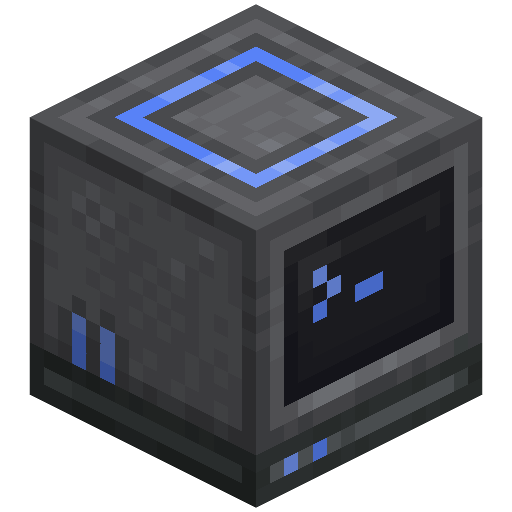

<p align="center">
  
</p>

<h1 align="center">CC: Unix</h1>

A modern industrial-tech themed resource pack for [ComputerCraft: Tweaked](https://modrinth.com/mod/cc-tweaked).

Unix reskins ComputerCraft's computers, turtles, monitors, and peripherals with a clean, industrial look — dark casings, consistent accent colors, and vanilla-friendly details. The pack aims to align CC: Tweaked textures with the new Advanced Peripherals textures and Mekanism machine blocks, so mixed setups look cohesive.

## Features

Retextured and remodeled ComputerCraft: Tweaked blocks, items, and GUIs:

| Category             | Covered                                     |
| -------------------- | ------------------------------------------- |
| Computers            | Desktop units across all tiers and states   |
| Turtles              | Upgraded shells and inventory interface     |
| Monitors             | Display units including multi-block setups  |
| Storage and printing | Disk handling and printing devices          |
| Audio and networking | Sound, signaling, and connection hardware   |
| Portable devices     | Handheld units and their interface          |
| Items                | Storage media and printed materials         |
| Interface            | Themed terminal frames and utility controls |

Includes subtle animations for status lights and interface elements.

## Requirements

- Minecraft Java Edition with a resource-pack format compatible with `pack_format` 34 (see `pack.mcmeta`, `supported_formats: [3, 34]`)
- [ComputerCraft: Tweaked](https://modrinth.com/mod/cc-tweaked) (or a fork using the `computercraft` namespace)

## Build from source

Requires [Node.js](https://nodejs.org/) v22.6.0 or later with npm.

The build script is TypeScript (`build.ts`) and runs directly via the
`--experimental-strip-types` flag (introduced in Node.js v22.6.0). Node.js
v22.18.0 and later can run it with no flag. Older Node.js versions cannot
run the build script as-is.

```bash
npm install
npm run build
```

This produces `out/Unix.zip`. The build script (`build.ts`):

1. Copies `assets/`, `pack.mcmeta`, `pack.png`, and `LICENSE` into `out/`.
2. Deletes all `*_blockbench.json` source files (Blockbench working copies kept in-repo but excluded from the pack).
3. Zips the result to `out/Unix.zip` and cleans up intermediate files.

Other scripts:

```bash
npm run clean         # remove out/
npm run format        # prettier --write .
npm run format:check  # prettier --check .
```

## Project structure

```text
.
├── assets/computercraft/   # pack contents (computercraft namespace)
│   ├── blockstates/        # e.g. cable.json
│   ├── lang/               # en_us.json
│   ├── models/block/       # computers, turtles, monitors, modems, printer, speaker, ...
│   ├── models/item/        # cable.json, disk.json
│   └── textures/
│       ├── block/          # per-face block textures + monitors/{normal,advanced}/
│       ├── gui/            # terminal borders, sidebars, turtle + pocket GUIs, buttons
│       └── item/           # pocket computers, disks, printed pages/books
├── pack.mcmeta             # pack_format 34 (MC 1.21–1.21.1), description
├── pack.png                # pack icon
├── LICENSE                 # CC BY 4.0 — also shipped at ZIP root
├── CREDITS                  # author credits — also shipped at ZIP root
├── build.ts                # resource-pack builder / zipper
└── out/                    # build output (gitignored, contains Unix.zip)
```

### Blockbench workflow

Files ending in `_blockbench.json` (mostly monitor and modem variants) are authoring sources. They are stripped automatically by `npm run build`, so the shipped zip only contains the final `*.json` models. Keep both in sync when editing models.

`*.bbmodel` files and `.blockbench/` folders are gitignored.

## Contributing

1. Edit textures under `assets/computercraft/textures/` or models under `assets/computercraft/models/`.
2. Run `npm run format` and `npm run build`, then test `out/Unix.zip` in-game.
3. Open a PR against `6ixB/unix-cct-resource-pack`.

## Releasing

Releases are cut from tags. Tag format is `v<pack>-mc<mc>` (pack version,
then tested Minecraft version), e.g. `v1.0.0-mc1.21.1`. Pushing a matching
tag triggers the Release workflow, which runs `npm run build` and publishes
the ZIP to a GitHub Release. Filenames follow the Modrinth convention
(`<pack>+mc<mc>` build metadata, lowercase slug), so the example tag ships
`unix-1.0.0+mc1.21.1.zip`. Tags use `-mc` because `+` is invalid in GitHub
tag filter patterns.

```bash
git tag v1.0.0-mc1.21.1
git push origin main v1.0.0-mc1.21.1
```

Keep `package.json` version and the tag's pack version in sync.

## License

Licensed under [CC BY 4.0](https://creativecommons.org/licenses/by/4.0/) for the original Unix work. You are free to share and adapt, even commercially, as long as you credit 6ixB. Third-party files derived from ComputerCraft GreenTech remain under MIT — see [LICENSE](LICENSE) Third-Party Notices. See [LICENSE](LICENSE) and [CREDITS](CREDITS).

## Credits

- Author: [6ixB](https://github.com/6ixB)
- Base mod: ComputerCraft: Tweaked — all block/item IDs and original assets belong to their respective authors.
- Adapted work: [ComputerCraft GreenTech](https://modrinth.com/resourcepack/computercraft-greentech) by PirateSee (MIT) — GUI textures, printed media, pocket computer and cable textures/models derive from this pack. See LICENSE.
- Inspiration: [Create: ComputerCraft (CC: Tweaked)](https://www.curseforge.com/minecraft/texture-packs/create-computercraft) by End_Rage — computer, monitor, and cable textures inspired by this pack.
- AI assistance was used for descriptions and developer tooling. All textures and models are human-created.
